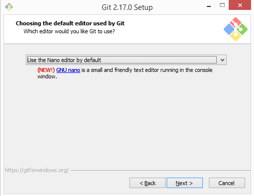

# Important

If you are running a University administered machine, you will hopefully have pre-configured your machine.
The following installations will only be able to be performed if you have Administration privileges on your computer.
If you have not pre-configured your machine, we will provide you with an USB containing a live install of Ubuntu for you to use.

## Installing Bash on Windows

If you are running Windows 10 and have [already installed Ubuntu as an app](https://tutorials.ubuntu.com/tutorial/tutorial-ubuntu-on-windows#0), please use this installation in preference to the below.
Otherwise, please follow these instructions to install a working version of bash on your computer.
This is part of the version control software `git` and is the best alternative for Windows.
There are some subtle differences between Mac and Linux versions, but most of will be cosmetic for these sessions.

1. Download and install `git bash` by going to the following site: [https://git-for-windows.github.io/](https://git-for-windows.github.io/) and selecting the `Git-2.xx.x-(32|64)-bit.exe` file as is appropriate for your computer.
If you're unsure if you have a 32 or 64 bit computer, follow [these instructions](https://www.lifewire.com/am-i-running-a-32-bit-or-64-bit-version-of-windows-2624475)
2. Please install to `C:\Program Files\Git` (the default). If you do install elsewhere please change any file paths below accordingly.
3. Accept all defaults **until you see the following screen**. Please use the drop-down menu to select `nano` as the default editor instead of `vim`.

4. When presented with this screen during installation, select the first option

5. Accept defaults *for all other options*, especially the following:

## Installing Notepad++

Although we may not use this much today, an excellent alternative editor for scripts on the Windows OS is *Notepad++*.
A key difference between Windows and Linux/OSX systems is the *hidden characters* used to denote `end-of-line` (EOL).
Most editors such as Wordpad, MS Word etc **will change these without you knowing** and scripts will not be able to be run if edited using these programs.
*Notepad++* does not do this and using this software will allow you to edit scripts conveniently without breaking them.

Notepad++ can be obtained from [here](https://notepad-plus-plus.org/download/v7.5.1.html)

[Home](../)
