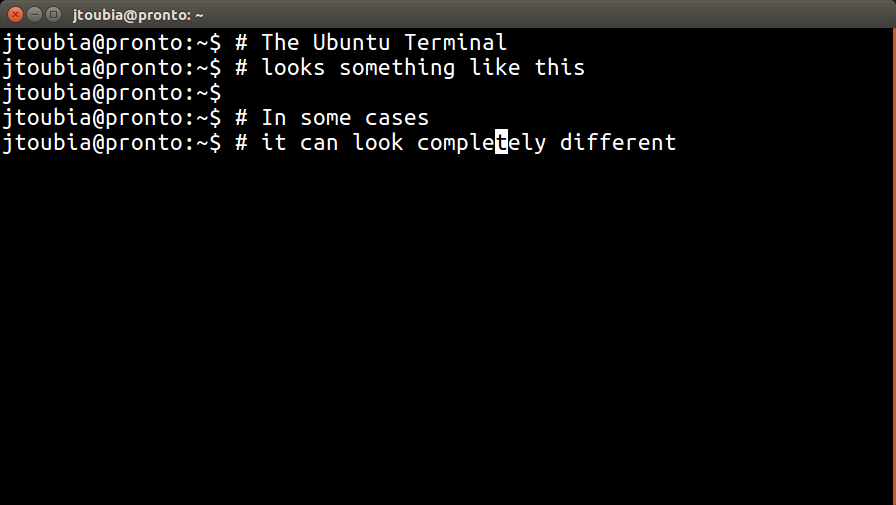
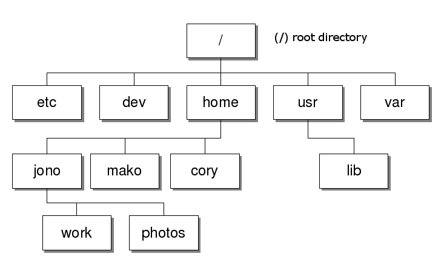
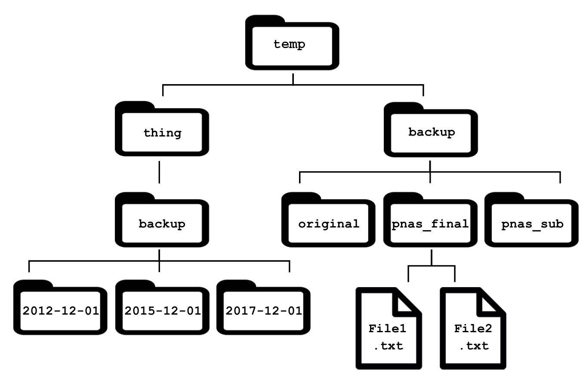
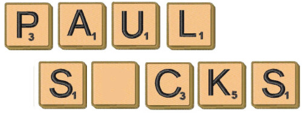
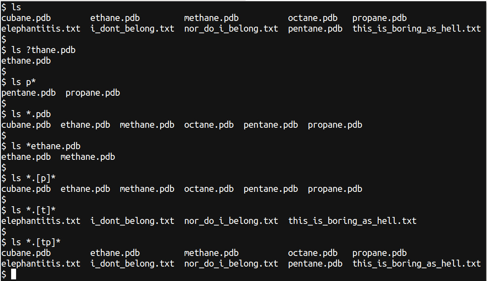

# Introducing Bash

## Background

Command-line tools are the mainstay of analysis for large (biological or non-biological) data sets. Good candidate examples for command-line analyses in bioinformatics are:

- manual inspection of fastq, bam & sam files from NGS pipelines
- automating analyses across multiple datasets/experiments
- manipulations of data which are repetitive or laborious to perform manually
- job submission to HPC clusters

Today we’ll explore a few commands to help you gain a little familiarity with some important ones, and to enable you to find help when you’re working by yourself. We don’t expect you to remember all the commands & options from today. The important thing is to become familiar with the basic syntax for commands, how to put them together, and where to look for help when you’re unsure.

### Why should you learn the basics

The command-line is a bit of a beast and is often thought of as daunting. To soften the blow, try not to think of it as a choice between the command-line and the Graphical user innterface (GUI) but rather as an extra tool in the tool box. There are tasks that are more suited and easier to complete using the GUI. However, many tasks and especially so in the field of bioinformatics, are better off completed and sometimes only available on the command-line.

The command-line may feel more like programming than using a mouse but in essence its almost the same thing. Some advantages of using the command-line over the GUI are;

- rich set of inbuilt tools
- ability to combine tools into powerful pipelines and to easily handle large volumes of data
- reproducibility and sharing of workflows
- easiest way to interact with remote PC’s and supercomputers

Unfortunately it also comes with a few disadvantages;
- primarily textual in nature
- steep learning curve

Learning even just the basic bash commands will open up new avenues of exploration in any data science project you might tackle. And, may even get you over the line on that new job application … What have you got to loose?

### Initial Goals

1. Gain familiarity and confidence within the `bash` environment
2. Learn how to navigate directories, as well as to copy, move & delete the files within them
3. Look up the help page of a command needed to perform a specified task

### What is bash (command-line/terminal/shell/prompt)

These are names for basically the same thing and will often be used interchangeably.

The command-line has a library of programs (commands) which are built into it at the time of installing the operating system, some of which are part of the "Bourne-again Shell", or bash. We’ll explore a few of these commands today. If you’ve ever heard of the phrase shell scripts, this refers to a series of these commands strung together into a text file which is then able to be executed as a single command.

Without further ado,

## Open your Terminal - Meet the prompt.

Firstly we need to open a terminal as we did during the set-up steps.
Mac/Linux users will notice some text describing your computer of the form

 `user@computer:~$`

Windows users will see

`MINGW64:~`

or something similar.

The terminal interface will look different as you browse around the room. Here is an example of what it usually looks like in a Linux environment.



On bash you will have this “$” sign on most lines. The text before the dollar sign is called the “prompt”, which usually tells you something about your username, the current folder you are in, your remote computers name and other things that can be set. Because of this ability to manually customise the prompt, it may look different between computers that share the exact same operating system.

The main point here is that all the bash commands you'll use in this workshop should be typed after the "$"

The prompt is there to indicate that the shell is waiting for a task/instruction. The user defines the task by using the keyboard and typing in commands. The shell then evaluates the command, processes and returns the output. Following this the shell provides a new prompt and is ready to do it all over again. The whole process is often referred to as REPL (read - evaluate - print - loop)

Lets try it with some simple commands. Type the command `ls` in the terminal.

```
ls
```

The command `ls` stands for listing and does simply as the name implies, lists the contents of a directory/folder. More to come on this! ls is possibly one of the most used commands on the comman-line and we will use it often throughout this workshop. Now try this as well

```
echo $SHELL
```

echo is like an inbuilt print command and $SHELL is a system variable that holds the name of the current shell in use. Some of these terms like variable may seem foreign but don’t worry too much about them right now, we’ll get to all of that in good time.

We need to take note of a couple of things before we move on. First, the shell is case sensitive! try the second command all in lower case like this

```
echo $shell
```

Can you explain the output? a Linux-based file system such as Ubuntu or Mac OS-X is case-sensitive, whilst Windows is not. As such, the command `LS` is completely different to `ls` and if `LS` is the name of a command which has been defined in your shell, you will get completely different results than from the intended ls command.

***handy tip: *** the shell has a memory that can be traversed by using the up and down arrow keys. You may not have much in there yet but try it out and make use of it as much as you can, its a massive time saver. You also have the ability to modify and rerun any command stored in history by moving the cursor left or right with the arrow keys and deleting and/or adding appropriate text.

### Are you lost? Orientation in bash

Type the command `pwd` in the terminal and you will see the output which describes the `home` directory for your login (in most cases!).

```
pwd
```

The command `pwd` is what we use to **p**rint the **w**orking **d**irectory (the directory that you currently reside in). This paticular directory is usually referred to as your *home* directory. This is also the information that the tilde represents as a shorthand version, so whenever you see the tilde in a directory path, it is interpreted as *home* directory (more on this to come).

***NOTE: *** In the above command, the home directory began with a slash, i.e. `/`. On a Unix-based system (Linux and Mac), this is considered to be the root directory of the file system. Windows users would be more familiar with seeing `C:\` as the root of the drive, and this is an important difference in the two directory structures. Note also that whilst Windows uses the backslash (\\) to indicate a new directory, a Linux-based system uses the forward slash (/), or more commonly just referred to simply as `slash`, marking another but very important difference between the two OS's. Git bash on Windows adopts the Unix style.

### Know thine file system!

To gain a better understanding of the concept your home directory, we first need to know how the file system as a whole is configured. On most modern OS’s the file system is laid out in a hierarchical manner. Files and folders are housed in other folders which in turn (with other files) are also housed in folders and so on all the way to the top folder which houses everything. This all-encompassing top level folder is commonly referred to as root and is represented by the lone forward slash /. Windows users would be more familiar with seeing C:\ as the root of the file system, and this is a very important difference in the two directory structures. Note also that whilst Windows uses the backslash (\) to indicate a new directory, a Linux-based system uses the forward slash (/), or more commonly just referred to simply as “slash”.



Here’s a depiction of the Linux file system. Obviously, there is a lot missing in the above figure. The home directory (sue) for user Sue is housed within the home folder which itself is housed within the root folder. The path all the way from the top is thus “root–>home –>sue” or in command-line terms /home/sue.

***Note: *** the forward slash is also used to delimit or separate the individual folder names (and file name too).

***Note: *** Spaces are highly important on the command line, so take note of them where-ever they appear in the given commands. Best practice is to avoid using spaces whenever naming folders or files (more on this to come).

#### task
Lets diverge a bit and do a small group exercise. Open a GUI file/directory browser on your machine and move around. Whilst you are exploring pay attention to the horizontal navigation bar that tells you where you are. As you move around try and get a feel for how a path is built.

### Changing Directories (`cd`)

In this section we will learn how to change directories using `bash`.
Try to mirror this using your conventional GUI approach so you can understand what's actually happening.

With your GUI based file/directory browser, change to the directory indicated by the `pwd` command. Now let's go the other way, navigate to a random spot on your machine using the GUI and then try to get to that same spot in the terminal

The built-in command which we use to *change directory* is `cd`. For example, If I want to get to a folder located at root–>home–>johnny–>workshop1, I could do this

```
cd /
cd home
cd johnny
cd workshop1
```

We can also move through multiple directories in one command by separating the folder and file names with the forward slash “/”. For example, we could also get to the same directory by typing this

```
cd /home/johnny/workshop1
```

Use the `ls` command to inspect the contents of the folder and compare it to what you see in the GUI.

***Note: *** you may have come stuck here due to "absolute" and "relative" paths. We'll clear this up in the next section.

No matter where we are in a file system, we can move up a directory in the hierarchy by using the command

```
cd .. #the space between the `cd` and `..` is important and the hash character on this line is special too. Why?
```

The string `..` is the convention for *one directory above*, whilst a single dot `.` represents the current directory.

Enter the above command and notice that the location immediately to the left of the \$ has now changed. This is also what will be given as the output if we entered the command `pwd` again.

If we continue to enter

```
cd ..
```

enough times we should end up in the root directory of the file system. Try it and print the working directory again (`pwd`). The output should be the root directory given as `/`.

We can change back to our home directory from anywhere by entering one of:

```
cd ~
```

or even just

```
cd
```

### Looking at the Contents of any Directory

We have used this command a bit now `ls`: **l**i**s**t the contents of a directory. With `ls`, we can specify which directory we wish to view the contents of, without having to change into that directory. We simply type the ls command, followed by a space, then the directory we wish to view the contents of. To look at the contents of the root directory of the file system (i.e. /), we simply add that directory after the command `ls`.

```
ls /
```

Here you can see a whole raft of directories which contain the vital information for the computer’s operating system. Among them should be the /home directory which is one level above your own home directory, and where the home directories for all users are located, as mentioned earlier.

### Relative Vs Absolute Paths

To aid you in your understanding of this concept lets do a simple mind experiment. Can anyone explain to me how to get to their office in this building?

There really is only 2 ways to do so;
1. identify a shared known point of interest (landmark) and give step by step directions
from there
2. give step by step directions from where we are right now

The same concept applies to the terminal except that there is only one landmark (not exactly true!) which is root `/`. All paths starting with / are said to be absolute. These paths, if correct, will work no matter where you are in the file system. On the other hand a relative path makes use of the fact that the terminal knows exactly where it is and so you can tell it where you want to go relative to that position. In summary, absolute paths specify a location (file or directory) in the system all the way from the top most folder (root directory) and thus always start with `/`. Relative paths specify a location in the system relative the the current working directory and will never start with the slash. This is an important point which will hopefully become more clear throughout the session.

***Note: *** The terminal also knows of one more landmark which we hinted at before and that is the users home directory. As mentioned before, the special charater to denote this location is the tilda `~`. It can be used from anywhere as a landmark just like the slash. Try it!

#### Questions

Look through the following paths and guess which are absolute and which are relative.
1. /var/www/log/dmesg
2. ../Desktop/temp/log.txt
3. /home/greg/Documents/thesis.docx
4. ./var/www/
5. home/jack/music/live.mp3

Starting from /home/amanda/data/, which of the following commands could Amanda use to navigate to her home directory, which is /home/amanda?
1. cd .
2. cd /
3. cd /home/amanda
4. cd ../..
5. cd ~
6. cd home/amanda
7. cd /data/..
8. cd
9. cd ..

### Tab Completion

Typing in long paths and/or filenames can be tedious. The terminal has a special feature which aids in completing this task called tab completion.

A very helpful and time-saving tool in the command line is the ability to automatically
complete a command, file or directory name using the `tab` key. Try typing
```
ls /home/<the first letter of your username> <tab>
```

where `<the first letter of your username>` would be j for me and `tab` represents the tab key.

Notice how your username is completed automatically! This functionality will automatically fill as far as it can until conflicting options are reached. In this case, there was only one option so it was able to complete all the way to the end of the file path. This enables us to quickly enter long file paths without the risk of typos. Using this trick will save you an enormous amount of time trying to find why something doesn’t work. The most common error we’ll see today will be mistakes in file paths caused by people not takingv advantage of this trick.

Now enter

```
ls ~/D <tab>
```

and it will look like the auto-complete is not working. This is because there are two possibilities and it doesn’t know which you want. Hit the tab twice and both will appear in the terminal, then choose one. As well as directory paths, you can use this to auto-complete filenames.

***Note: *** This technique can be used to also find command names. Type in `he` followed by two strikes of the `tab` key and it will show you all of the commands that being with the string `he`, such as head, help or any others that may be installed on your computer. If we’d hit the `tab` key after typing `hea`, then the command head would have auto-completed, although clearly this wouldn’t have saved you any typing.

***Note: *** And just to reiterate, you can scroll through your previous commands by using the up arrow to go backward, and the down arrow to move forward. This can be a big time saver if you’ve typed a long command with a simple typo, or if you have to do a series of similar commands.

## Working with Files and Directories

So we now know how to move around and explore the file system from within the terminal but how do we create new ones or modify what already exists.

### Make/Remove Directories

Let move to our home directory if we are not already there and then move into the Desktop folder

```
cd /home/<user>/Desktop
```

Now, check the contents of this directory (you should be aware of the contents before you run the command)

```
ls
```

Lets create a folder. In the terminal we create directories using the command `mkdir` which
is short for **M**a**k**e **Dir**ectory. Make Directory just like Change Directory takes one
argument (more about arguments later). In this case it will be the name of the folder to
create. Lets call it “practice_folder”.

```
mkdir practice_folder
```

#### Questions

Can you think of an alternative argument that would result in the same outcome? Hint: was that a relative or absolute path?

Also, note that we used the underscore symbol to conect the two words in the folder name. What do you think would happen if we replaced it with a space?

That was simple. Lets get rid of it now. The command we use to remove a directory is rmdir which is short for **R**e**m**ove **Dir**ectory.

***Note: *** rmdir only works on empty directories. Later we’ll learn how to delete folders even if they contain files.

### Make/Remove Files

Interestingly, unlike mkdir there is no dedicated command to make a file. Fortunately, anyone of about a dozen commands that manipulate files will, when executed, create a file if that file does not already exist. The most commonly used command to acheive this is `touch` which was originally created for an entirely different purpose. I don’t know anyone who uses touch for it’s intended purpose anymore but it’s an easy way to make a new file. Create a new file called “practice_file”.

```
touch practice_folder
```

Easy! It’s empty but we created it. Check that it’s there before removing it using `rm` which is short for **R**e**m**ove.

```
rm practice_file
```

### Copy/Move/Rename Files/Folders

When calling the commands to make or remove files/directories we provide one peice of information (argument) to the command which is the name of the object to create/remove. With the `cp` and `mv` (stands for copy and move repectively) commands, we need to provide an additional peice of information (2 arguments).

1. the name of the object we want to copy/move
2. the place in the file system to move the object to

The order is important so the command must look like this,

```
cp <name_of_object_to_copy> <location_to_copy_object_to>
# OR
mv <name_of_object_to_move> <location_to_move_object_to>
```

***Note: *** renaming a file OR folder is just a special case of the mv command. For example, given the file “file one.txt”, we would use the mv command like this to rename it

```
mv file_one.txt renamed_file.txt
```

#### task

In the current directory, see if you can recreate these folders in the correct structure. After you have finished, try deleting the “Users” directory.



If you are keen, try creating a few folders/files in the current directory and then moving them to there correct location.

### Removing non-empty directories

As is, neither “rmdir” or “rm” will delete a folder that contains an object. To do so we must recursively delete the contents one at a time or by using a wild card (more on this to come). However, there is a flag in the “rm” command that does this automatically. Try this on your newly created folders,

```
rm Users
```

that won't work!

```
rm -r Users
```

Done!

### Wildcards

Alternatively referred to as a wild character or wildcard character, a wildcard is a symbol used to replace or represent one or more characters. Wildcards are typically either an asterisk (*), which represents one or more characters or question mark (?), which represents a single character. Not sure if anyone plays or has played card games? In certain card games the joker is used as a wildcard meaning that the owner of that joker can choose to view it as any one of the 52 playing cards in the deck. A similar concept is the blank tile in Scrabble which can be used as any one of the letters in the alphabet in order to complete words (like Paul and ”Socks”!)



Wildcards in the terminal are somewhat like this. Here is the basic set of wildcards;

1. ? Question mark - represents exactly one character and can be used side by side to represent more characters (ie. ??? for exactly 3).
2. * Asterix - represents zero or more characters
3. [ ] Closed square brackets - user defined range of characters

we have set up some exercises for you to try out your skills using wildcards and below
are some examples of how wildcards are used.


