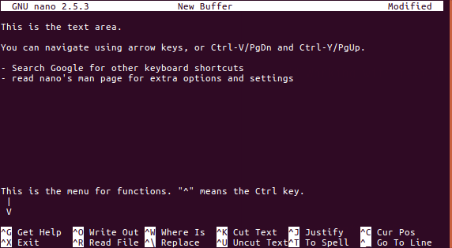
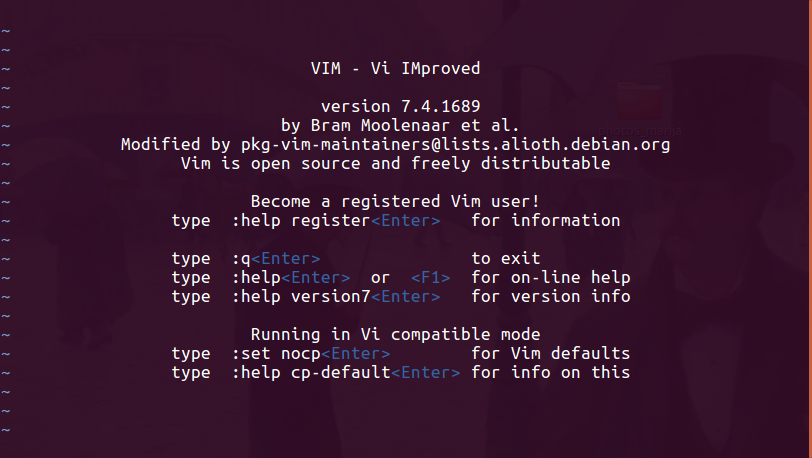
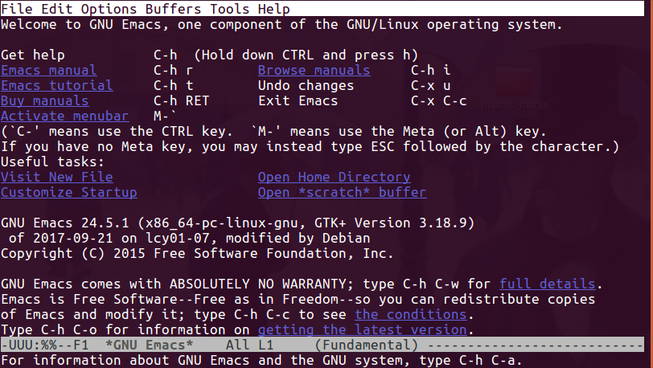
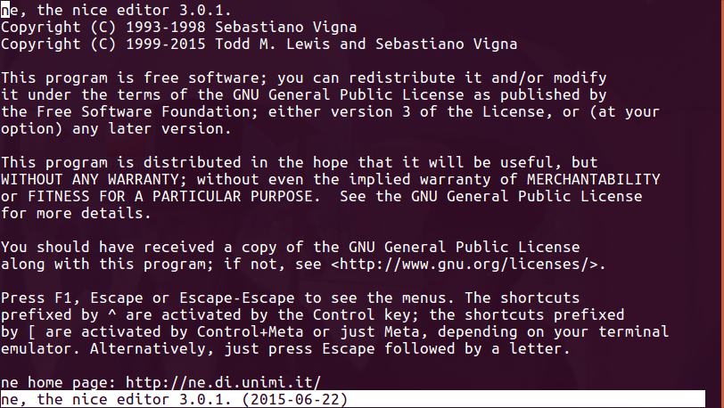

* TOC
{:toc}


# Grep, Sed and Awk

In this session, we will learn about a few of the most frequently used tools that are very useful for extracting and modifying data.

## Command Line Interface (CLI) Text editors (for Small-ish Files)

In general, we rarely work with binary file formats (e.g. MS Office files) in the command line interface (CLI). Instead, we work with ASCII (or plain text) files.

We can use a GUI program like gedit or pluma (Ubuntu), Text Edit (Mac OS X), or Notepad (Windows) to edit these files. However, there are also several command line programs available that you can use to edit files inside the command line console.

#### Nano (or Pico)
{:.no_toc}

- **Nano**/**Pico**:  Nano is an easy to use text editor. On most Linux systems, just type `nano` to start the program (or `pico`, the command `pico` is often soft-linked to `nano`<sup>[1]</sup>).
To quit, hold [Ctrl] and press X (^X).
There are a couple important caveats to remember when using Nano:
  - Nano will load the entire file into memory, so it may take a while when working with large files.
  - Be careful when editing configuration files, as Nano hard-wraps long lines by default. This behaviour can be disabled by `-w` option.



#### Vi (or Vim)
{:.no_toc}

- **vi**/**vim**: **vi** is arguably the most popular text editor among Linux users. It was designed to minimise hand movements, thus allowing very fast typing and editing. However, it has very steep learning curve and are usually not recommended for beginners.
To start **vi**, just enter `vi`. If you are using a recent Linux distribution, you may notice that it is actually running **vim**.
- **To quit:** type `:q`



#### Emacs
{:.no_toc}

- **Emacs**: Emacs is another popular CLI text editor. There are many flame wars on older Internet sites centred on whether **vi** or **Emacs** is better. To start Emacs, just enter `emacs`. However, this will probably bring up a windowed mouse-enabled version. To use the pure CLI version, type `emacs -nw`.
- **To quit:** type `^x^c` (i.e. `[Ctrl]-X [Ctrl]-C`, or in Emacs shorthand: `C-x  C-c`).<sup>[3]</sup>



#### Ne
{:.no_toc}

- **ne** (**n**ice **e**ditor) is intended to be easier to use than **vi**, but more functional than **nano**.
Start by **ne** by entering `ne`.<sup>[4]</sup>
- If you are stuck in `ne`, press [Esc] twice to display the program menu.



-----

## Prepare the data files (and some revision exercises)
For this session, we need to prepare some data files for demonstration and we'll also need to create some directories.

```
cd ~
mkdir -p BashWk3/files
cd BashWk3/files
```
(**Q:** What did the `-p` argument do in the above `mkdir` command?)


1. Download and uncompress the file [`GRCh38.chr22.ensembl.biomart.txt.gz`](../files/GRCh38.chr22.ensembl.biomart.txt.gz) into the newly-created `files` directory, keeping the original as well as the uncompressed verison.

  (*Hint: when uncompressing the gzip file, use the `-k` option to keep the original gzip file.*)

2. Download and extract the file [`3_many_files.tar.gz`](../files/3_many_files.tar.gz) in the `files` directory.
This should create a sub-directory (`3_many_files`) containing 100 files, where each file contains a subset of the data in `GRCh38.chr22.ensembl.biomart.txt.gz`.

  (*Hint: Refer to last week for details on how to extract a tar archive.*)

3. Use what you have learnt so far and find out:

  - What is the size of the uncompressed file (`GRCh38.chr22.ensembl.biomart.txt.gz`)? How many characters, words and lines does it contain?
  - How are the data organised in the file?
  - What is the column separator?
  - How many columns does it contain?
  - What are the column headers?
  - Which column is "**Gene name**"? How many unique gene names are there in the file?

4. Can you answer the above questions without uncompressing the original file?

You should now have some idea of the structure of the data file.

The list of column names below will be useful:

```
1	Gene stable ID
2	Transcript stable ID
3	Chromosome/scaffold name
4	Gene start (bp)
5	Gene end (bp)
6	Strand
7	Karyotype band
8	Transcript start (bp)
9	Transcript end (bp)
10	Transcription start site (TSS)
11	Transcript length (including UTRs and CDS)
12	Gene name
13	Gene type
14	Transcript type
15	Gene % GC content
16	GO term name
17	GO term definition
18	GO domain
19	HGNC symbol
20	Reactome ID
21	Gene description
```

We will also need the file `BDGP6_genes.gtf` from previous session, so let's copy that across.
Make sure you're in the `BashWk3/files` directory first.

```
cp ../../BashWk2/BDGP6_genes_gtf ./
```

-----

## Working with large files or many files

Text editors (either CLI or GUI) are very convenient when you want to quickly edit a small text file (if you just want to read the file, you can use `less` or `cat`), however, they are less useful when the files are very large.

Consider the following questions (try using **nano** to answer them):

For `GRCh38.chr22.ensembl.biomart.txt`:

1. What is the first line that contains "**DNAJB7**"? Give line number.
  <details><summary>Hint:</summary>
  You will need `^W` (search), and `^C` (view line number), unless you really enjoy counting and scrolling line by line.
  </details>  

2. How many lines contain "**DNAJB7**"?

  <details><summary>Hint:</summary>Use `M-W` (`[Alt]-W`) to repeat search.
  </details>  

3. How many lines contain "**RBX1**"?  

4. In how many non-header entries (lines) are the "**Gene name**" and "**HGNC symbol**" values different?  

5. Change all instances of "**TBX1**" in "**Gene name**" and "**HGNC symbol**" columns to "**TBX-1**", but not in other columns.  

<details><summary>**Answers**</summary>

1. 55151

2. 1 line only

3. Too many to count in **nano** (but the answer is 5775).

4. Too hard in **nano** (answer is 36).

5. Replacing one or all instances is possible. But replacing only values in specific columns is very tedious.
</details>  

Now look into the files in the created sub-directory `3_many_files`.  

1 - Open the file **`datafile1`** in nano. Does it contain an entry for "MAPK1"?  

2 - Which files in **`3_many_files`** directory contain entries for "MAPK1"?  
(*Hint: This is super tedious to do manually, and we'll show you the quick way soon.*)  
  <details><summary>**Answers**</summary>

  1. There is an entry for MAPK11, but not MAPK1.

  2. It would be too much work to go through each file individually, but the answer is datafile11, datafile26, datafile28,
  datafile32, datafile36, datafile38, datafile46, datafile51, datafile63, datafile80, datafile82, datafile83, datafile84, datafile95, datafile98.

  </details>  


Hopefully by now you can appreciate that using text editors are not the best way to query large data sets.
As an aside, usually when you are working in BASH (or some other Linux/UNIX CLI) and you find yourself doing something repetitively, then there is probably a better way of doing it.
In the rest of this session, we will examine three of the most commonly used CLI tools for working with large text data sets: `grep`, `sed`, and `awk`.  

-----

### Primer on Linux Command Structure

Before we introduce these tools, you may find it useful to familiarise yourself
with [the structure (or syntax) of a typical Linux command](extra_command_syntax.md).
However, feel free to continue on if you already understand the topic.

-----


# `grep`

**`grep`**<sup>[5]</sup> is an utility for searching fixed-strings or regular expressions in plaintext files. The basic syntax of a grep command requires two arguments:

```
grep [PATTERN] [FILE]
```

which would search for the string PATTERN (either fixed string or regular expression) in the specified FILE. For example, to search for the string `DNAJB7` in `GRCh38.chr22.ensembl.biomart.txt`, we would enter:

```
grep DNAJB7 GRCh38.chr22.ensembl.biomart.txt
```

By default, **`grep`** prints every line that contains at least one instance of search pattern. (In modern terminal programs, matching strings in each line will be highlighted.)

You can also search for multiple files at the same time, by:

- Providing multiple file names:

```
grep DNAJB7 3_many_files/datafile1 3_many_files/datafile2
```

- Or by using file name wild-cards:

```
grep DNAJB7 3_many_files/datafile2?
```

```
grep DNAJB7 3_many_files/*
```

**`grep`** has many useful options. You can find out all of the available options by reading its help page (`man grep` or `grep --help`). We will look at examples of some of the more common options.


#### Example 1 (`-w`)
{:.no_toc}

If we want to retrieve entries related to **DDT** gene, we may try a command like:

```
grep DDT GRCh38.chr22.ensembl.biomart.txt
```

However, this will also retrieve entries that match **DDTL**.
To retrieve entries which are only related to DDT, we can use the `-w` option:

```
grep -w DDT GRCh38.chr22.ensembl.biomart.txt
```

This will match lines that contain the string "`DDT`" which are immediately flanked by non-word constituent characters (word constituent characters are alphanumerics and the underscore) and therefore DDTL will no longer match.


#### Example 2
{:.no_toc}

One of the columns in the file is "**GO term name**". If we want to search for entries for which the value in this column is "transport", we may try something like:

```
grep -w transport GRCh38.chr22.ensembl.biomart.txt
```

However, if you examine the output you will see that it also retrieved many lines in which "transport" is simply a word in a longer phrase or sentence, sometimes in the "GO term name" column, and sometimes in other columns.

This is because the `-w` option will allow for any non-alphanumerical, including spaces and commas, whereas what we really want are instances where entire column value is just "transport". In other words, we are looking for the string "`[tab]transport[tab]`":

```
grep "[tab]transport[tab]" GRCh38.chr22.ensembl.biomart.txt
```

To enter an actual [tab] character, you need to **use the key sequence:*** `[Ctrl-V][tab]`. Just pressing the `[tab]` key will not work.

While this works when you are entering commands directly in the command line terminal, it will not work in a script (as you will see in the next session). So the alternative method is to use the usual tab symbol representation (`\t`), but for this to work, you'll also need to use the `-P` option in **`grep`**:

```
grep -P "\ttransport\t" GRCh38.chr22.ensembl.biomart.txt
```

#### Example 3: case sensitivity
{:.no_toc}

*We will use `BDGP6_genes.gtf` for this example.*

As you should know by now, unlike Windows, in Linux almost everything is case sensitive. If we want to search for the entry for a gene "Zen", we can try:

```
grep -w Zen BDGP6_genes.gtf
```

However, this will return zero results. This is because the gene name used is "zen". So we can perform an case-insensitive search using the option `-i`:

```
grep -wi Zen BDGP6_genes.gtf
```

#### Example 4: searching for multiple terms at the same time
{:.no_toc}

If we want to extract the entries for genes "Ada" and "Zen", we can search for them separately, but this can become tedious quickly.

One method to search for multiple terms at the same time is to use *extended* grep, which is enabled by the option `-E`. (Or simply use the command `egrep`, which is the same as `grep -E`):

```
grep -Ewi "(Ada|Zen)" BDGP6_genes.gtf
```

While this may work fine for just a few terms, if we want to search for many terms  this can still be rather tedious. We can try using the `-f` option instead.

For example if we want to search for these genes: Ace, Ada, Zen, Alc, Alh, Bdp1, Bft, bwa.

First we need to create a file, and enter the genes of interest one per line. Call this file "gene_names". Then we can perform the search by:

```
grep -wif gene_names BDGP6_genes.gtf
```

However, take care that there are no trailing spaces after the gene names, and there are no empty lines.


#### Example 5: inverse search
{:.no_toc}

We can use the `-v` option to perform an inverse search. For example, to extract entries for all protein-coding genes, we can run:

```
grep -w protein_coding BDGP6_genes.gtf
```

But if we want to get all *other* entries, we can instead run:

```
grep -v protein_coding BDGP6_genes.gtf
```


#### Example 6: simple regular expression
{:.no_toc}

One of the most useful feature of `grep` is the ability to search using regular expressions.
However, we don't have the time to cover the full scope of the regular expression support provided by `grep`. But here we will demonstrate a few basic cases.

## Wild-cards

Regular expressions allow us to search beyond exact string matches.
The simplest cases are the use of wild-cards. File name wild-cards use `?` and `*` for single and zero-to-multiple character match, respectively.
**Here, `.` is the only wild-card symbol**. For example:

```
grep -w a.z BDGP6_genes.gtf
```

The star symbol `*` is also used, but it means to match any number of the previous character, by itself it does not match anything. So:

- `grep * BDGP6_genes.gtf` will return nothing
- `grep an*x BDGP6_genes.gtf` will match any string that starts with `a`, ends with `x`, and has 0 or multiple `n`s in between.

## Range search

`grep` provides a more restrictive pattern matching through the use of square brackets: `[]`. Any letters inside the square brackets is allowed. For example:

- `a[bc]d` will match `abd` and `acd`
- `a[a-z]e` will match everything from `aaa`, `abe`, ... to `aze`, the dash means a range.
- `a[0-5]e` will match `a0e`, `a1e`, `a2e`, `a3e`, `a4e` and `a5e`, so range works for numerics too.

The following command is looking for entries with any gene name matching `ada`, `adc`, `ala` and `alc`:

```
grep -wi A[dl][ac] BDGP6_genes.gtf
```

Unfortunately, it is also matching entries that contain gene names like `"tRNA:Ala-AGC"`. So let's be a bit more specific, and search for terms that are flanked by double-quotes:

```
grep -wi "\"A[dl][ac]\"" BDGP6_genes.gtf
```

## Exclusion

We can also use the caret symbol (`^`) to exclude specific characters.
For example `A[^dl][ac]` will match any 3-letter term that begins with `A`,
ends with `a` or `c`, but doesn't have `d` or `l` in the middle. So this command:

```
grep -wi "\"A[^dl][ac]\"" BDGP6_genes.gtf
```

should show lines containing `Ama`, `Apc`, `ara`, `ACC` and `ana`.

## Anchoring

Suppose we want to extract all entries from chromosome 3R from the file `BDGP6_genes.gtf`.
If we simply run this command:

```
grep 3R BDGP6_genes.gtf
```

there is no guarantee that the string "3R" does not appear somewhere else in the line and not at the beginning. In fact, one of the lines return is matching to the gene name "Rpn13R". Using the option `-w` may help a bit, but what we really want is that the string "3R" appears at the start of the line.
To do this, we use the caret symbol (`^`), again.

```
grep ^3R BDGP6_genes.gtf
```

The caret symbol tells `grep` to look for "3R" only at the beginning of the line.
Similarly we use dollar sign ($) to look for strings anchor at the end of the line.


#### Exercises
{:.no_toc}

1) Create a list of gene names from BDGP6_genes.gtf:

```
cut -f 2 -d ";" BDGP6_genes.gtf | cut -f 2 -d "\"" | grep -v "^#" | sort | uniq > fly_genes
```

Can you explain what the command above is doing? A good way of testing a complex command line is to simply break it down and examine the output from each section.

```
cut -f 2 -d ";" BDGP6_genes.gtf
cut -f 2 -d ";" BDGP6_genes.gtf | cut -f 2 -d "\""
cut -f 2 -d ";" BDGP6_genes.gtf | cut -f 2 -d "\"" | grep -v "^#"
cut -f 2 -d ";" BDGP6_genes.gtf | cut -f 2 -d "\"" | grep -v "^#" | sort | uniq > fly_genes
```

2) Extract from the file created above ("fly_genes") gene names that:

- start with "z"
- start with "a" and ends with a numeral
- contain non-alphanumerics
- contain a dot `.`  

<details><summary>Answers</summary>
1. `grep ^z fly_genes`
2. `grep ^a.*[0-9]$ fly_genes` or `grep ^a fly_genes | grep [0-9]$`
3. `grep [^a-z0-9] fly_genes`
4. `grep "\." fly_genes `
</details>  

3) Look up the help page to see which option can provide the line number of search output.


## More `grep` functions

If you look into the help page for `grep`, you will see that `grep` has 4 different modes of pattern matching:

1. `-G/--basic-regexp` is the default basic mode;
2. `-E/--extended-regexp` is the extended mode we have used earlier;
3. `-P/--perl-regexp` supports the Perl-style regular expression, while;
4. `-F/--fixed-strings` only performs exact matches.<sup>[6]</sup> Using the extended or Perl modes, you can perform even more complex and flexible searches.

Unfortunately we don't have time to cover it all in this session, but if you wish to learn more about it, you should look up `grep` tutorials online.

-------------

# `sed`


While `grep` is excellent at searching, it essentially only performs queries and does not allow us to edit the output.
For that we need different tools.
Like most command line utilities, `sed` is designed to process input data (file or stream) line by line.
From the GNU sed documentation (https://www.gnu.org/software/sed/manual/sed.html):

> sed is a stream editor. A stream editor is used to perform basic text
transformations on an input stream (a file or input from a pipeline). While in
some ways similar to an editor which permits scripted edits (such as ed), sed
works by making only one pass over the input(s), and is consequently more
efficient. But it is sed’s ability to filter text in a pipeline which
particularly distinguishes it from other types of editors.

It is important to remember that `sed` is a very complex tool that has been in use and constantly
evolving for decades, and as it's open-sourced it has diverged on different platforms.
Therefore `sed` on Mac OSX may not work exactly the same as on Linux, this is the classic `BSD` vs `GNU` issue which we've already come across.
For this workshop, we typically focus on GNU tools (Linux).
If you are on OSX and find that some things don't quite work, please ask (or perform a Google search).

`sed` is a very complex tool, and it is impossible to cover all its functions in this session.
Here we will only show you the most common usage 1) printing select lines from a file, and 2) search-and-replace.

## Basic Printing with `sed`

A basic `sed` command has the form: `sed SCRIPT INPUTFILE` where the script contains instructions on how to process the input.
At it's simplest, we can simply print a few rows very much like `head`.
In the following command, we'll print the first 10 lines of the file.

```
sed -n '1,10p' BDGP6_genes.gtf
```

By default, `sed` will stream the entire file to `stdout` so by setting the `-n` flag we're turning this function off, and my including `'1,10p'` we're telling `sed` to print (`p`) lines 1 to 10.
Unlike `head` or `tail` which only print the beginning or end of the file, `sed` can print lines from anywhere in the file.

```
sed -n `5,9p` BDGP6_genes.gtf
```

`sed` can also print a recurring pattern of lines. In the following, we'll print every 2nd line, starting at the 1st line.
This will just dump everything into the terminal, so if you want to look more carefully, pipe the output into `head` or `less`.

```
sed -n `1~2p` BDGP6_genes.gtf
```

## Editing Text 'On The Fly'

First, let's prepare a smaller file so that it's easier to see how `sed` functions.
Extract from `BDGP6_genes.gtf` all entries that contain "Ac3", "ADD1", and "Acn"
into a file, "small.gtf".

<details><summary>Hint</summary>
```
egrep "(Ac3|ADD1|Acn)" BDGP6_genes.gtf > small.gtf
```
</details>


 Let us consider a basic search-and-replace command:

```
sed 's\Ac3\AC-3\' small.gtf
```

`sed` can be called to directly act on a file, or be used to process a standard stream.
So the following command is essentially the same:

```
cat small.gtf | sed 's\Ac3\AC-3\'
```

If you run the command, you should see that:
1. by default the entire content of the file is printed
2. the string "Ac3" has been replaced by "AC-3"

Let us now examine the second term, `'s\Ac3\AC-3\'` (also, the s command, or the "script"):

1. The enclosing quotation marks are necessary. You can also use double-quotes ("), but they are problematic with the backslash.
2. The backslashes are separators that **divide the expression into 4 parts**.
   - the first part is `s`, which tells `sed` that it is to perform *substitution*.
   - the second part is the *search pattern*,
   - the third part is the term to *replace with*,
   - the fourth part is empty at the moment

You can actually use any character for the separator.
In this case, any symbol or character after the first `s` is recognised as the separator character. You can choose whichever feels most comfortable to use, but be careful not to use a symbol or character that also appears in the search term or replacement term. For example:

- `sed 's Ac3 AC-3 ' small.gtf` uses space " " as separator
- `sed 's1Ac31AC-31' small.gtf`  (deliberately confusing) also works, and uses "1" as separator
- `sed 's3Ac33AC-33' small.gtf`  *doesn't work*, because it's trying to use "3" as separator, but 3 also appears in the search and replacement terms.

## s command flags

The fourth and last part of the s command contain zero or more flags that alter the default behaviour.

A frequently used flag is "g", which means global replacement. By default, the s command will only perform substitution for the first matching instance:

- `sed 's\gene\GENE\' small.gtf`  will only alter the first instance of "gene" in each line, where as
- `sed 's\gene\GENE\g' small.gtf` will alter all instances.

Rather than using "g", we can also use a number to specify exactly which instance to alter:

```
sed 's\gene\GENE\2' small.gtf
```

will alter the second instance only.

Another frequently used flag is "I" or "i", which allows for case-insensitive matching.

`$ sed 's\fly\FLY\ig' small.gtf` will alter any and all upper/lower-case combinations of "fly" to "FLY".

## Regular expressions

The search term in `sed` supports regular expression in very similar ways to `grep`.
As exercises, can you explain what each of these `sed` commands are doing?

1) `sed 's|ac[n3]|ACX|Ig' small.gtf`

2) `sed 's\^\chr\' small.gtf`

3) `sed 's\;$\\' small.gtf`

<details><summary>Answers</summary>

1. Change all instances of acn/ac3 (case-insensitive) to ACX
2. Append "chr" to the start of every line
3. Strips off ";" at the end of the line

</details>


## Formatting replacement strings

Sometimes, we want to alter a string by adding to it without modifying the search term itself.
For example, if we want to add a star symbol next to gene names Acn and Ac3, without altering gene names. We can perform this one by one:

```
sed 's\Acn\Acn*\' small.gtf | sed 's\Ac3\Ac3*\'
```

or we can use regular expression search and "&":

```
sed 's\Ac[n3]\&*\' small.gtf
```

where "&" simply means the string that matches the search pattern.

Can you explain what the following command does?

```
sed 's\fly\&OrWorm\gi' small.gtf
```

## Redirecting output

Like most stream editors, `sed` does not alter the original file, and instead writes the output to the stdout.
Therefore to save the changes, we can simply redirect to a file:

```
sed 's\Ac[n3]\&*\' small.gtf > small_starred.gtf
```

As is almost the case, you should **never** redirect the file back to itself, expecting it to have made the changes in place.
You will simply end up with an empty file!

But `sed` actually has an option that will allow you to make edits *in-place*: `-i`/`--in-place`<sup>[7]</sup>.

```
sed 's\Ac[n3]\&*\' small.gtf > small.gtf
```

THIS WILL FAIL (data loss!).
Check the contents using `cat`, `head` or `sed` and you'll see the file is now empty.

First we'll recreate the file

```
egrep "(Ac3|ADD1|Acn)" BDGP6_genes.gtf > small.gtf
```

Now we'll try the correct approach where we edit the file *in place*.

```
sed -i 's\Ac[n3]\&*\' small.gtf
```

THIS WILL WORK on Ubuntu and `git bash`.
Note: On Mac OSX `-i` (i.e. BSD `sed`) doesn't work without an argument provided. In GNU sed, `-i` can be used with or without an argument.


## Exercise: Batch-rename files

In the directory **`3_many_files`**, there are a number of files with only a single digit (e.g. datafile1), this makes it harder to sort the files in numerical order. So ideally we want to rename the files with single digit to double digit:

`mv datafile1 datafile01`

It's a bit tedious to do this one by one, can you write a command line that can do this all in one go?

<details><summary>Answer</summary>
This command line will generate all the required "mv" commands:
```
ls datafile? | sed 's|[0-9]|& datafile0&|' | sed 's|^|mv |'
```
We can then add "| sh " to the end to execute it all:
```
ls datafile? | sed 's|[0-9]|& datafile0&|' | sed 's|^|mv |' | sh
```
</details>

-------------

# `awk`

`awk` is a tool frequently used for querying and extracting information from tabulated data files, and also has the ability to write formatted output. In fact, `awk` is a programming language<sup>[8]</sup>, which means that it has some functions/features that are not provided by `grep` or `sed`. But it also means that we don't have the time to cover everything in this session.

Some of the most important (or most commonly used) features of `awk` are:

- typically used with tabulated data files (.csv or .tsv)
- can perform numerical comparison
- can format output more easily than `sed`

Again, as this workshop is based on GNU awk, some of the commands may not work correctly in Mac OSX.

## Text searching

In one of the examples for `grep`, we wanted to search for entries which have "transport" as value in the "GO term name" column.
While it was possible, we could not guarantee that the output was absolutely correct, since `grep` doesn't have the ability to specify the location (column) in a line.

However in `awk`, we would run a command line like:

`$ awk -F "\t" '$16=="transport" {print $0}' GRCh38.chr22.ensembl.biomart.txt  `

Let's break the command line down into components:

- ` awk `
- ` -F "\t" `
- ` '$16=="transport" {print $0}' `
- `  GRCh38.chr22.ensembl.biomart.txt `

1) `awk` is simply calling the `awk` command, while the last part `GRCh38.chr22.ensembl.biomart.txt` specifies the input file. `awk` also accepts `stdin`.

2) the second part `-F "\t"` is not entirely necessary. It specifies that the separator (`-F`) to be used for this command is the tab character (`"\t"`). `awk` can do perform some auto-detection to check whether the separator is space, comma or tab, but it doesn't always get it right, so sometimes it is safer to explicitly specify the separator.

3) the third part is the "program", analogous to the SCRIPT in `sed`. It tells `awk` how to process the input data.
In this example, the program is relatively simple, consists of only a single rule, which have the format of:

`pattern { action }`

In this example, the pattern is `$16=="transport"`, meaning that the 16th term (separated by tab) is exactly equal to "transport" (string values are enclosed in quotation marks). We can use `!=` to specify "not equal to".

Once `awk` finds a line that matches the specified pattern, it performs the action stated in `{ }`, which in this case is: `print $0`, simply meaning to print the entire line.

Alternatively, we can also print just the chromosome ($3), positions ($4, $5) and gene name ($12):

`$ awk -F "\t" '$16=="transport" {print $3 $4 $5 $12 $16}' GRCh38.chr22.ensembl.biomart.txt  `

However, if you run the command line above, you'll notice that the values are not separated. This means that:

- `-F` applies to only the input
- if not printing the entire line, we need to be more specific about how to print the output.

Try this instead:

`$ awk -F "\t" '$16=="transport" {print "chr" $3 ":" $4 "-" $5 "\t" $12 "\t" $16}' GRCh38.chr22.ensembl.biomart.txt  `

Remember that string values need to be enclosed in quotation marks.

Other than exact matching using "==", `awk` also supports partial matching and regular expression. We won't go into regular expression here, but to retrieve list of genes and GO term where the GO term contains "process", we can run:

`$ awk -F "\t" '$16~"process" {print $16 "\t" $12}' GRCh38.chr22.ensembl.biomart.txt | sort | uniq `

This will match lines with "process" anywhere in the 16th column. We can also use `^` and `$` to match to the start and end, similar to `grep` and `sed`.


## Numerical searching

One of the big advantage of `awk` is that it is able to perform range comparison. For example, the file `GRCh38.chr22.ensembl.biomart.txt` has "Gene start (bp)" (col 4) and "Gene end (bp)" (col 5). If we want to extract entries within a specific range, it is very difficult to do in `grep` for two main reasons:

- `grep` does not have true numerical comparison
- `grep` cannot search for values in a specific column

Whereas in `awk`, if we want to find genes where "Gene start" value is less than 16,000,000, we can simply run:

`awk -F "\t" '$4 < 16000000 {print $4 "\t" $12}' GRCh38.chr22.ensembl.biomart.txt | sort | uniq`


## Combining search patterns

We can combine multiple search patterns using `&&` (and) and `||` (or). For example:

`awk -F "\t" '$7=="q12.1" && $16=="transport"' GRCh38.chr22.ensembl.biomart.txt`

The command above requires two conditions to be met:

- `$7=="q12.1"`: Karyotype band is "q12.1"
- `$16=="transport"`: GO term is "transport"

You may have noticed that no action is specified in the command. In such cases, the default behaviour of `awk` is to print the entire line.

## Exercise

Extract lines from the file `BDGP6_genes.gtf` that satisfies these conditions:

- on chromosome "3R"
- starting position is between 1,000,000 and 5,000,000
- is a protein-coding gene

For an extra point, print out just the gene names rather than entire lines.

<details><summary>Answer</summary>
<pre>
awk -F "\t" '$1=="3R" && $4>=1000000 && $4<=5000000 && $9~"protein_coding" {print $9}' BDGP6_genes.gtf | cut -f 2 -d ";" | cut -f 2 -d "\""
</pre>
</details>


-------------

# Exercises

Go back to [Working with large files or many files](#working-with-large-files-or-many-files) and see if you can answer the questions in that section using what you have learnt in this session.

-------------

# Combining everything and more advanced functions


```
sed 's|; |\t|g' BDGP6_genes.gtf | \
  sed -E 's\gene_(id|name|source|biotype) \\g' | \
  sed 's\[";]\\g' | \
  grep -v "^#"
```

Can you explain what the command above does? (*Answer: converts the gtf file to a simple tab-separated file.*)

Re-direct the output to a file: `BDGP6_genes.tsv`.

As `awk` is a programming language, we can write much more complicated conditions using `if` and `else`. Here we have two different "if" conditions, and each have its own matching action to perform:

```
awk -F "\t" '{
  if ($1 == "3R" && $12 == "protein_coding" && $4<=1000000)
     print $10 " is a protein-coding gene";
  else if ($1 == "2L" && $12 == "snoRNA" && $4 <=1000000)
     print $10 " is a snoRNA";
  }' BDGP6_genes.tsv
```


-------------


*Footnotes*

[1] Nano is a opensource GNU clone of the proprietary program, Pico.

[2] Emacs is not installed by default on Ubuntu (16.04). To install, type `sudo apt install emacs` on Ubuntu or `apt`-based Linux systems.

[3] The Control (Ctrl) key is usually denoted as `^`, however, sometimes (e.g. in Emacs) it is denoted as `C-`.

[4] You can install `ne` by entering `sudo apt install ne` on Ubuntu.

[5] `grep` is short for `g/re/p` (Global search for Regular Expression and Print), a command in the original UNIX text editor `ed` (precursor to `vi`/`vim`).

[6] If you are wondering why there is a mode which doesn't do any regular expression, this is because by turning off all regular expression matches, exact string search can be much faster. The datasets we have for this workshop are not large enough to see any differences, so we can't quite demonstrate this. But you can test it yourself on any large plain-text files that you can find.

If you want to perform any benchmarking, you may find the command `time` to be useful. Just add it to the beginning of any command line, e.g.: `$ time grep -v protein_coding BDGP6_genes.gtf`

[7] Technically, `sed -i` isn't making the changes in-place. It's writing the output to a temporary file, then renaming the temporary file to the original file name.

[8] The GNU awk language manual: https://www.gnu.org/software/gawk/manual/gawk.html
