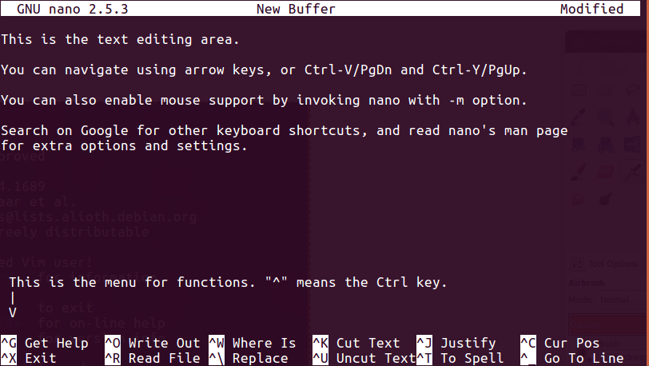

* TOC
{:toc}

# Grep, Sed and Awk

In this lesson, we will learn about a few of the most frequently used tools that are very useful for extracting and modifying data.

## Command Line Interface (CLI) Text editors (for small-ish files)

In general, we rarely work with binary file formats (e.g. MS Office files) in the command line interface (CLI). Instead, we work with ASCII (or plain text) files.

We can use a GUI program like gedit or pluma (Ubuntu), Text Edit (Mac OS X), or Notepad (Windows) to edit these files. However, there are also several command line programs available that you can use to edit files inside the command line console.

<ol>
<li> **Nano**/**Pico**:  Nano is an easy to use text editor. On most Linux systems, just type `nano` (or `pico`, the command `pico` is often soft-linked to `nano`[1]) to invoke the program. To quit, hold [Ctrl] and press X (^X).
There are a couple important caveats to remember when using Nano:

<ul>
<li> Nano will load the entire file into memory, so it may take a while when working with large files.

<li> Be careful when editing configuration files, as Nano hard-wraps long lines by default. This behaviour can be disabled by `-w` option.
</ul>

<li> **vi**/**vim**: **vi** is arguably the most popular text editor among Linux users. It was designed to minimise hand movements, thus allowing very fast typing and editing. However, it has very steep learning curve and are usually not recommended for beginners.
To start **vi**, just enter `vi`. If you are using a recent Linux distribution, you may notice that it is actually running **vim**.

  **To quit:** type `:q`

  

<li> **Emacs**: Emacs is another popular CLI text editor. There are many flame wars on older Internet sites centred on whether **vi** or **Emacs** is better. To start Emacs, just enter `emacs`. However, this will probably bring up a windowed mouse-enabled version. To use the pure CLI version, type `emacs -nw`.

  **To quit:** type `^x^c` (that is: `[Ctrl]-X [Ctrl]-C`, or in Emacs shorthand: `C-x  C-c`).[3]

  

<li> **ne**: **ne** (nice editor) is intended to be easier to use than **vi**, but more functional than **nano**. Start by **ne** by entering `ne`.[4]

  If you are stuck in `ne`, press [Esc] twice to show the program menu.

  

</ol>

## Working with large files

CLI text editors are very convenient when you want to quickly edit a small text file (if you just want to read the file, you can use `more`, `less` or `cat`), however, they are less useful when the files are very large. Let's try working on a data file using **nano**.

<table>
<tr><td bgcolor="#EEEEEE">
** *Preparing the data file and some exercises* **
  
<ol>

<li>Locate and uncompress the file `GRCh38.chr22.ensembl.biomart.txt.gz` in the `files` directory:
  
  `$ gunzip -k GRCh38.chr22.ensembl.biomart.txt.gz`
  
  (**Q:** What is the function of the option `-k`?)
  

<li>Use what you have learnt so far and find out:
    <ul>
  <li> What is the size of the uncompressed file?
   
  <li> How many characters, words and lines does it contain?
   
  </ul>
   

<li>How are the data organised in the file? i.e. does it look like a tabulated data file? If so, then:
   <ul>
   <li> What is the column separator?
   <li> How many columns does it contain?
   <li> What are the column headers?
  </ul> 

<li>Which column is "**Gene name**"? How many unique gene names are there in the file?
  

<li>Can you derive the answers to questions 2-4 without uncompressing the original file?
</ol>
</td></tr>
</table>

You should now have some idea of the structure of the data file. Now, open the file in nano:

`$ nano GRCh38.chr22.ensembl.biomart.txt`

This will takes a few seconds, depending on your machine. Other editors (vi, emacs) may be a bit faster.

Try answering these questions:

1. What is the first line that contains "**DNAJB7**"?

  

Hint:

  You will need `^W` (search), and `^C` (view line number), unless you really enjoy counting and scrolling line by line.

2. How many lines contain "**DNAJB7**"?

  

Hint:
Use M-W ([Alt]-W) to repeat search.

3. How many lines contain "**RBX1**"?

4. Ignoring the header, in how many entries (lines) are the "**Gene name**" and "**HGNC symbol**" values different?

5. Change all instances of "**TBX1**" in "**Gene name**" and "**HGNC symbol**" to "**TBX-1**".

**Answers**

<ol>
<li> 55151
<li> 1 line only
<li> Too many to count in **nano** (but the answer is 5775).
<li> Too hard in **nano** (answer is 36).
<li> *Madness! I am NOT doing that!*
</ol>

*Footnotes*

[1] Nano is a opensource GNU clone of the proprietary program, Pico.

[2] Emacs is not installed by default on Ubuntu (16.04). To install, type `sudo apt install emacs` on Ubuntu or `apt`-based Linux systems.

[3] The Control (Ctrl) key is usually denoted as `^`, however, sometimes (e.g. in Emacs) it is denoted as `C-`.

[4] You can install `ne` by entering `sudo apt install ne` on Ubuntu.
